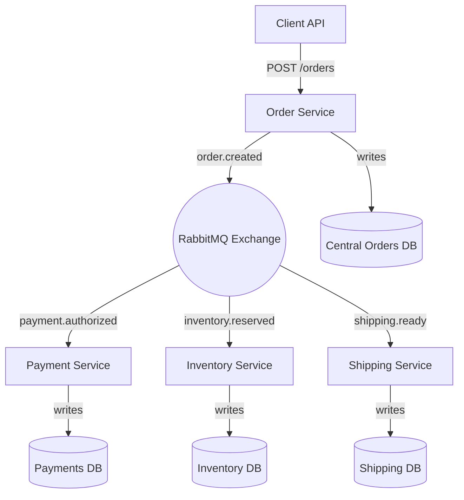

# Fault Tolerant Order Processing System
A distributed, fault tolerant microservices system for order processing built with **Python, FastAPI, RabbitMQ, and PostgreSQL**. It's designed to handle orders through events, keep working even if a service fails, and scale like a real distributed system.

---

## About the Project
The system simulates an e-commerce backend where customer orders pass through multiple stages:
1. **Order Service** – Accepts incoming orders via FastAPI and publishes to RabbitMQ.  
2. **Payment Service** – Consumes `order.created`, simulates payment authorization, and publishes `payment.authorized`.  
3. **Inventory Service** – Consumes `payment.authorized`, reserves stock, and publishes `inventory.reserved`.  
4. **Shipping Service** – Consumes `inventory.reserved`, creates shipments, and publishes `shipping.ready`.  

### Fault Tolerance
- RabbitMQ queues are **durable** and configured with **Dead Letter Queues**.  
- Failed messages are retried and eventually routed to a DLQ if recovery isn't possible.  
- Each service has its own **PostgreSQL database**, ensuring data consistency and isolation.  
- Monitoring is supported via **CloudWatch** to track queue depth, latency, and uptime.  

---

## Architecture


## ⚙️ Tech Stack
- **Language:** Python 3.11  
- **Framework:** FastAPI  
- **Message Broker:** RabbitMQ  
- **Database:** PostgreSQL (locally) / Amazon RDS (cloud)  
- **Deployment:** Docker Compose (locally), AWS EC2 (cloud)  
- **Monitoring:** AWS CloudWatch  
- **Testing:** Pytest, Locust (load testing)  

---

## 🚀 Getting Started
### Prerequisites
- [Docker](https://docs.docker.com/get-docker/)  
- [Docker Compose](https://docs.docker.com/compose/)  

### Installation
1. Clone the repo:
   ```sh
   git clone https://github.com/your_username/fault-tolerant-order-system.git
   cd fault-tolerant-order-system
   ```

2. Start all services:
   ```sh
   docker-compose up --build
   ```

3. Verify services:
   ```sh
   Order API: http://localhost:8000/orders
   RabbitMQ Dashboard: http://localhost:15672
   ```

---

## 📊 Usage

### Submit a new order
```bash
curl -X POST "http://localhost:8000/orders" \
     -H "Content-Type: application/json" \
     -d '{
           "order_id": "123",
           "user_id": "42",
           "items": ["Book"],
           "total": 20.0
         }'
```

### Simulating a failure 
```bash
curl -X POST "http://localhost:8000/orders" \
     -H "Content-Type: application/json" \
     -d '{
           "order_id": "999",
           "user_id": "42",
           "items": ["Laptop"],
           "total": 2000,
           "force_fail": true
         }'
```

### Check order status
```bash
curl -X GET "http://localhost:8000/orders/123"
```

### Monitor RabbitMQ queues
Visit the RabbitMQ management UI at `http://localhost:15672` (guest/guest) to:
- View queue depths and message rates
- Check dead letter queues for failed messages
- Monitor exchange bindings and routing

---

## 🧪 Testing

### Unit Tests
```bash
# Run all tests
pytest

# Run with coverage
pytest --cov=src tests/

# Run specific test file
pytest tests/test_order_service.py
```

### Load Testing with Locust
```bash
# Install locust
pip install locust

# Run load test
locust -f tests/load_test.py --host=http://localhost:8000
```

### Integration Tests
```bash
# Run integration tests (requires running services)
pytest tests/integration/ -v
```

---

## 🐳 Docker Services

The system consists of the following containerized services:

| Service | Port | Purpose |
|---------|------|---------|
| order-service | 8000 | Main API endpoint |
| payment-service | 8001 | Payment processing |
| inventory-service | 8002 | Stock management |
| shipping-service | 8003 | Shipment creation |
| rabbitmq | 5672, 15672 | Message broker |
| postgres | 5432 | Database cluster |

### Service Health Checks
```bash
# Check all services
docker-compose ps

# View logs for specific service
docker-compose logs payment-service

# Restart a service
docker-compose restart inventory-service
```

---

## 🔧 Configuration

### Environment Variables
Create a `.env` file in the project root:
```env
# Database
POSTGRES_HOST=postgres
POSTGRES_PORT=5432
POSTGRES_DB=orders
POSTGRES_USER=admin
POSTGRES_PASSWORD=password

# RabbitMQ
RABBITMQ_HOST=rabbitmq
RABBITMQ_PORT=5672
RABBITMQ_USER=guest
RABBITMQ_PASSWORD=guest

# Services
ORDER_SERVICE_PORT=8000
PAYMENT_SERVICE_PORT=8001
INVENTORY_SERVICE_PORT=8002
SHIPPING_SERVICE_PORT=8003

# Retry Configuration
MAX_RETRY_ATTEMPTS=3
RETRY_DELAY_SECONDS=5

# AWS (for cloud deployment)
AWS_REGION=us-east-1
CLOUDWATCH_NAMESPACE=OrderProcessing
```

### Queue Configuration
Each service queue is configured with:
- **Durability**: Messages persist through broker restarts
- **Dead Letter Exchange**: Failed messages route to DLQ after max retries
- **TTL**: Messages expire after 24 hours if unprocessed
- **Prefetch Count**: Limits unacknowledged messages per consumer

---

## 📈 Monitoring & Observability

### Metrics Tracked
- **Queue Depth**: Number of pending messages per queue
- **Processing Latency**: Time from order creation to completion
- **Error Rates**: Failed message percentage per service
- **Throughput**: Orders processed per minute

### CloudWatch Dashboards
```bash
# Deploy monitoring stack (requires AWS credentials)
aws cloudformation deploy --template-file monitoring/cloudwatch-dashboard.yaml \
                          --stack-name order-system-monitoring \
                          --capabilities CAPABILITY_IAM
```

### Health Check Endpoints
```bash
# Service health
curl http://localhost:8000/health
curl http://localhost:8001/health

# Database connectivity
curl http://localhost:8000/health/db

# Queue connectivity  
curl http://localhost:8000/health/queue
```

---

## 🚀 Deployment

### Local Development
```bash
# Start in development mode with hot reload
docker-compose -f docker-compose.dev.yml up
```

### Production (AWS EC2)
```bash
# Deploy to EC2 instance
scp -r . ec2-user@your-instance:/home/ec2-user/order-system
ssh ec2-user@your-instance
cd order-system
docker-compose -f docker-compose.prod.yml up -d
```

### Kubernetes (Optional)
```bash
# Deploy to Kubernetes cluster
kubectl apply -f k8s/
kubectl get pods -n order-system
```

---

## 🛠️ Troubleshooting

### Common Issues

**Services won't start:**
```bash
# Check port conflicts
netstat -tulpn | grep :8000

# Reset containers
docker-compose down -v
docker-compose up --build
```

**Messages stuck in queues:**
```bash
# Purge queue via RabbitMQ management
curl -u guest:guest -X DELETE http://localhost:15672/api/queues/%2F/payment.queue/contents

# Or restart RabbitMQ
docker-compose restart rabbitmq
```

**Database connection errors:**
```bash
# Check PostgreSQL logs
docker-compose logs postgres

# Connect to database directly
docker exec -it postgres psql -U admin -d orders
```

### Performance Tuning

**High latency:**
- Increase RabbitMQ prefetch count
- Scale service replicas
- Optimize database indexes

**Memory usage:**
- Reduce message TTL
- Implement message batching
- Add connection pooling

---

## 🤝 Contributing

1. Fork the repository
2. Create a feature branch (`git checkout -b feature/amazing-feature`)
3. Commit your changes (`git commit -m 'Add amazing feature'`)
4. Push to the branch (`git push origin feature/amazing-feature`)
5. Open a Pull Request

### Code Style
- Follow PEP 8 for Python code
- Use type hints for all function signatures
- Add docstrings for public methods
- Run `black` and `flake8` before committing

### Testing Requirements
- Maintain >90% test coverage
- Include both unit and integration tests
- Test failure scenarios and edge cases

---

## 📄 License

This project is licensed under the MIT License - see the [LICENSE](LICENSE) file for details.

---

## 🙏 Acknowledgments

- [FastAPI](https://fastapi.tiangolo.com/) for the excellent async web framework
- [RabbitMQ](https://www.rabbitmq.com/) for reliable message queuing
- [PostgreSQL](https://www.postgresql.org/) for robust data persistence
- [Docker](https://www.docker.com/) for containerization simplicity

---

## 📞 Support

For questions or support:
- 📧 Email: [your.email@domain.com](mailto:your.email@domain.com)
- 🐛 Issues: [GitHub Issues](https://github.com/your_username/fault-tolerant-order-system/issues)
- 💬 Discussions: [GitHub Discussions](https://github.com/your_username/fault-tolerant-order-system/discussions)

---

**Built with ❤️ for distributed systems learning and production-ready order processing.**
