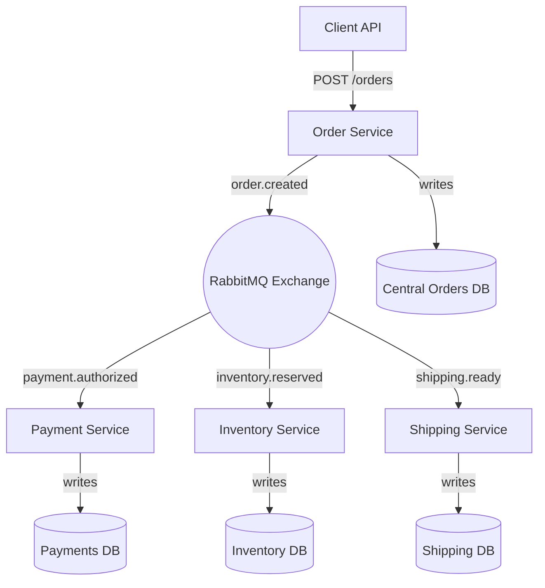

# Fault Tolerant Order Processing System

A distributed, fault tolerant microservices system for order processing built with **Python, FastAPI, RabbitMQ, and PostgreSQL**. It’s designed to handle orders through events, keep working even if a service fails, and scale like a real distributed system.

---

## About the Project

The system simulates an e-commerce backend where customer orders pass through multiple stages:

1. **Order Service** – Accepts incoming orders via FastAPI and publishes to RabbitMQ.  
2. **Payment Service** – Consumes `order.created`, simulates payment authorization, and publishes `payment.authorized`.  
3. **Inventory Service** – Consumes `payment.authorized`, reserves stock, and publishes `inventory.reserved`.  
4. **Shipping Service** – Consumes `inventory.reserved`, creates shipments, and publishes `shipping.ready`.  

### Fault Tolerance
- RabbitMQ queues are **durable** and configured with **Dead Letter Queues**.  
- Failed messages are retried and eventually routed to a DLQ if recovery isn’t possible.  
- Each service has its own **PostgreSQL database**, ensuring data consistency and isolation.  
- Monitoring is supported via **CloudWatch** to track queue depth, latency, and uptime.  

---

## Architecture




## ⚙️ Tech Stack

- **Language:** Python 3.11  
- **Framework:** FastAPI  
- **Message Broker:** RabbitMQ  
- **Database:** PostgreSQL (local) / Amazon RDS (cloud)  
- **Deployment:** Docker Compose (local), AWS EC2 (cloud)  
- **Monitoring:** AWS CloudWatch  
- **Testing:** Pytest, Locust (load testing)  

---

## 🛠️ Getting Started

### Prerequisites
- [Docker](https://docs.docker.com/get-docker/)  
- [Docker Compose](https://docs.docker.com/compose/)  

### Installation
1. Clone the repo:
   ```sh
   git clone https://github.com/your_username/fault-tolerant-order-system.git
   cd fault-tolerant-order-system

